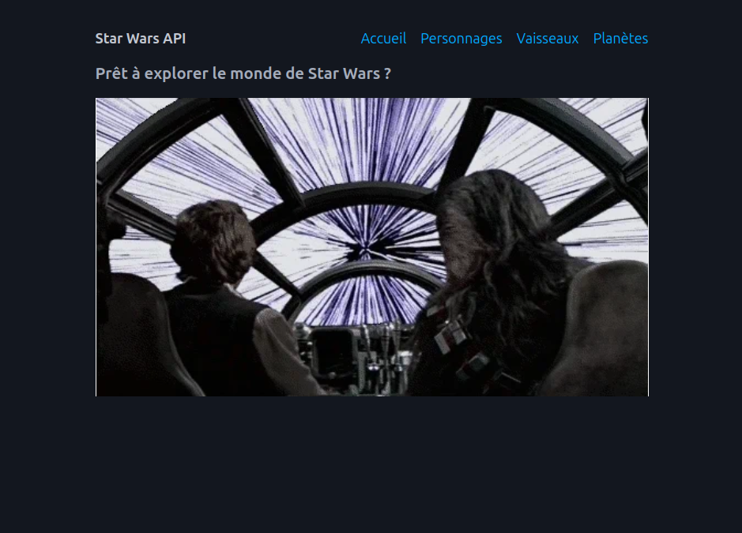

# Dark force sf

This is a small project to explore the Star Wars API.



## Start project

First build the project :

```bash
composer install
```

Then, run the server :

```bash
symfony serve:start -d
```

Then, go to [http://localhost:8000](http://localhost:8000).
